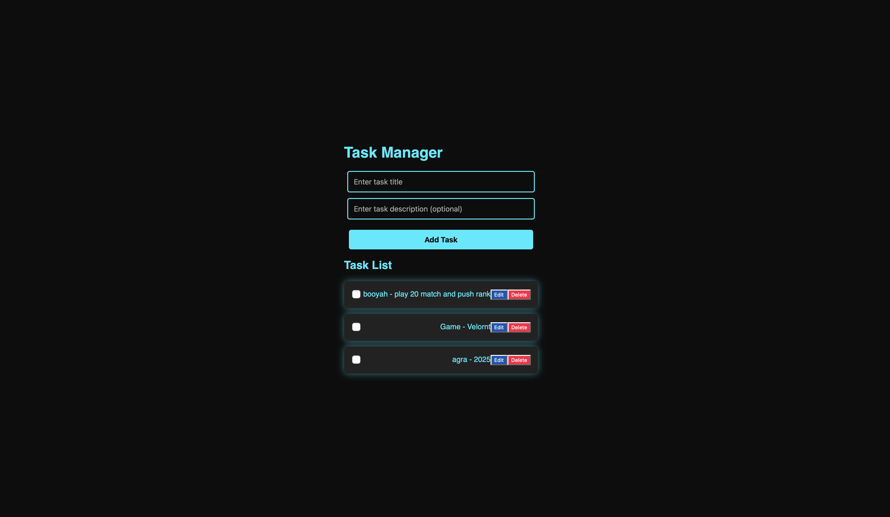
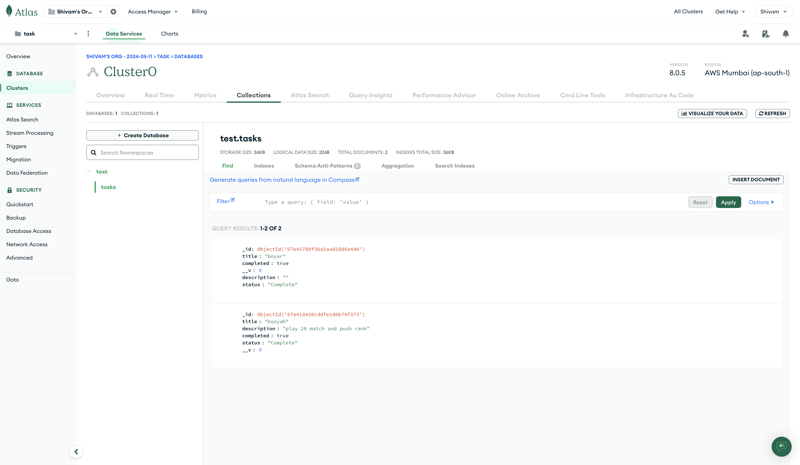

# algo-root-pvtltd-task
this is the internship task which is assigned by logo root pvtltd

# 🚀 Task Manager App (Neon Blue & Black Theme)

A *modern* and *fully responsive* Task Manager application built with *React* and *Node.js, featuring a **sleek black and neon blue UI*.

## 🎨 Live Demo  
🔗 [Live Preview](#) (Deploy your project and update this link)  

---

## 🖼 Screenshots  

### *🌟 Task Manager Web App*

### *🌟 MongoDB Setup*

---

## 🛠 Features  
✅ *Add, Edit, Delete Tasks*  
✅ *Mark Tasks as Complete/Incomplete*  
✅ *Neon Blue & Black Themed UI*  
✅ *Fully Responsive Design*  
✅ *Fast & Lightweight*  
✅ *Smooth Animations & Hover Effects*  

---

## ⚡ Tech Stack  
🔹 *Frontend:* React, CSS  
🔹 *Backend:* Node.js, Express  
🔹 *Database:* MongoDB  
🔹 *State Management:* React Hooks  
🔹 *Styling:* Custom CSS  
